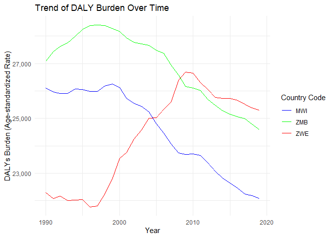

Global Disease Burden Analysis
================
Tiwonge Chimpandule & Stone Mbiriyawanda

# Introduction

This document compares the Disability-Adjusted Life Year (DALY) diseases
burden for three countries: COUNTRY 1, COUNTRY 2, and COUNTRY 3. We
compare the burden due to communicable, maternal, neonatal, and
nutritional diseases (CMNN), non-communicable diseases (NCDs), and
overall disease burden for these countries.

The source data is from the Institute for Health Metrics and Evaluation
(IHME) Global Burden of Disease (GBD) study.

# Communicable, Maternal, Neonatal, and Nutritional Disease Burden (CMNN)

## Table of Estimates for CMNN Burden Over Time

<table class="table table-hover table-striped" style="width: auto !important; margin-left: auto; margin-right: auto;">
<thead>
<tr>
<th style="text-align:right;">
Year
</th>
<th style="text-align:left;">
MWI
</th>
<th style="text-align:left;">
ZMB
</th>
<th style="text-align:left;">
ZWE
</th>
</tr>
</thead>
<tbody>
<tr>
<td style="text-align:right;">
1990
</td>
<td style="text-align:left;">
67,721
</td>
<td style="text-align:left;">
58,757
</td>
<td style="text-align:left;">
29,183
</td>
</tr>
<tr>
<td style="text-align:right;">
1991
</td>
<td style="text-align:left;">
69,612
</td>
<td style="text-align:left;">
62,679
</td>
<td style="text-align:left;">
32,113
</td>
</tr>
<tr>
<td style="text-align:right;">
1992
</td>
<td style="text-align:left;">
72,426
</td>
<td style="text-align:left;">
66,572
</td>
<td style="text-align:left;">
36,385
</td>
</tr>
<tr>
<td style="text-align:right;">
1993
</td>
<td style="text-align:left;">
77,205
</td>
<td style="text-align:left;">
69,735
</td>
<td style="text-align:left;">
41,868
</td>
</tr>
<tr>
<td style="text-align:right;">
1994
</td>
<td style="text-align:left;">
81,870
</td>
<td style="text-align:left;">
73,466
</td>
<td style="text-align:left;">
47,289
</td>
</tr>
<tr>
<td style="text-align:right;">
1995
</td>
<td style="text-align:left;">
83,524
</td>
<td style="text-align:left;">
77,051
</td>
<td style="text-align:left;">
53,692
</td>
</tr>
<tr>
<td style="text-align:right;">
1996
</td>
<td style="text-align:left;">
84,066
</td>
<td style="text-align:left;">
79,825
</td>
<td style="text-align:left;">
60,273
</td>
</tr>
<tr>
<td style="text-align:right;">
1997
</td>
<td style="text-align:left;">
84,671
</td>
<td style="text-align:left;">
81,799
</td>
<td style="text-align:left;">
65,190
</td>
</tr>
<tr>
<td style="text-align:right;">
1998
</td>
<td style="text-align:left;">
85,204
</td>
<td style="text-align:left;">
83,235
</td>
<td style="text-align:left;">
70,773
</td>
</tr>
<tr>
<td style="text-align:right;">
1999
</td>
<td style="text-align:left;">
84,776
</td>
<td style="text-align:left;">
84,186
</td>
<td style="text-align:left;">
75,438
</td>
</tr>
<tr>
<td style="text-align:right;">
2000
</td>
<td style="text-align:left;">
83,180
</td>
<td style="text-align:left;">
84,062
</td>
<td style="text-align:left;">
79,359
</td>
</tr>
<tr>
<td style="text-align:right;">
2001
</td>
<td style="text-align:left;">
81,973
</td>
<td style="text-align:left;">
84,768
</td>
<td style="text-align:left;">
81,583
</td>
</tr>
<tr>
<td style="text-align:right;">
2002
</td>
<td style="text-align:left;">
80,059
</td>
<td style="text-align:left;">
81,769
</td>
<td style="text-align:left;">
83,413
</td>
</tr>
<tr>
<td style="text-align:right;">
2003
</td>
<td style="text-align:left;">
77,455
</td>
<td style="text-align:left;">
78,563
</td>
<td style="text-align:left;">
84,343
</td>
</tr>
<tr>
<td style="text-align:right;">
2004
</td>
<td style="text-align:left;">
75,049
</td>
<td style="text-align:left;">
73,901
</td>
<td style="text-align:left;">
84,160
</td>
</tr>
<tr>
<td style="text-align:right;">
2005
</td>
<td style="text-align:left;">
71,587
</td>
<td style="text-align:left;">
69,419
</td>
<td style="text-align:left;">
82,068
</td>
</tr>
<tr>
<td style="text-align:right;">
2006
</td>
<td style="text-align:left;">
66,930
</td>
<td style="text-align:left;">
64,637
</td>
<td style="text-align:left;">
78,766
</td>
</tr>
<tr>
<td style="text-align:right;">
2007
</td>
<td style="text-align:left;">
61,515
</td>
<td style="text-align:left;">
57,853
</td>
<td style="text-align:left;">
74,505
</td>
</tr>
<tr>
<td style="text-align:right;">
2008
</td>
<td style="text-align:left;">
55,699
</td>
<td style="text-align:left;">
50,416
</td>
<td style="text-align:left;">
70,027
</td>
</tr>
<tr>
<td style="text-align:right;">
2009
</td>
<td style="text-align:left;">
50,336
</td>
<td style="text-align:left;">
45,610
</td>
<td style="text-align:left;">
64,407
</td>
</tr>
<tr>
<td style="text-align:right;">
2010
</td>
<td style="text-align:left;">
45,957
</td>
<td style="text-align:left;">
42,950
</td>
<td style="text-align:left;">
56,041
</td>
</tr>
<tr>
<td style="text-align:right;">
2011
</td>
<td style="text-align:left;">
41,755
</td>
<td style="text-align:left;">
40,191
</td>
<td style="text-align:left;">
48,766
</td>
</tr>
<tr>
<td style="text-align:right;">
2012
</td>
<td style="text-align:left;">
37,589
</td>
<td style="text-align:left;">
37,372
</td>
<td style="text-align:left;">
43,522
</td>
</tr>
<tr>
<td style="text-align:right;">
2013
</td>
<td style="text-align:left;">
34,435
</td>
<td style="text-align:left;">
34,920
</td>
<td style="text-align:left;">
39,995
</td>
</tr>
<tr>
<td style="text-align:right;">
2014
</td>
<td style="text-align:left;">
32,365
</td>
<td style="text-align:left;">
33,171
</td>
<td style="text-align:left;">
37,784
</td>
</tr>
<tr>
<td style="text-align:right;">
2015
</td>
<td style="text-align:left;">
30,933
</td>
<td style="text-align:left;">
31,649
</td>
<td style="text-align:left;">
35,857
</td>
</tr>
<tr>
<td style="text-align:right;">
2016
</td>
<td style="text-align:left;">
29,834
</td>
<td style="text-align:left;">
30,144
</td>
<td style="text-align:left;">
33,901
</td>
</tr>
<tr>
<td style="text-align:right;">
2017
</td>
<td style="text-align:left;">
28,120
</td>
<td style="text-align:left;">
28,970
</td>
<td style="text-align:left;">
32,081
</td>
</tr>
<tr>
<td style="text-align:right;">
2018
</td>
<td style="text-align:left;">
26,373
</td>
<td style="text-align:left;">
27,432
</td>
<td style="text-align:left;">
30,123
</td>
</tr>
<tr>
<td style="text-align:right;">
2019
</td>
<td style="text-align:left;">
25,069
</td>
<td style="text-align:left;">
25,908
</td>
<td style="text-align:left;">
28,869
</td>
</tr>
</tbody>
</table>

## Plot Showing Trends in CMNN Burden Over Time

<!-- -->

## Summary of CMNN Burden Findings

Malawi’s DALY’s were highest in the eealy 90’s but this changed in the
2000’s where the highest was Zimabwe’s.

# Non-Communicable Disease Burden (NCD)

## Table of Estimates for NCD Burden Over Time

<table class="table table-hover table-striped" style="width: auto !important; margin-left: auto; margin-right: auto;">
<thead>
<tr>
<th style="text-align:right;">
Year
</th>
<th style="text-align:left;">
MWI
</th>
<th style="text-align:left;">
ZMB
</th>
<th style="text-align:left;">
ZWE
</th>
</tr>
</thead>
<tbody>
<tr>
<td style="text-align:right;">
1990
</td>
<td style="text-align:left;">
26,111
</td>
<td style="text-align:left;">
27,086
</td>
<td style="text-align:left;">
22,298
</td>
</tr>
<tr>
<td style="text-align:right;">
1991
</td>
<td style="text-align:left;">
25,959
</td>
<td style="text-align:left;">
27,421
</td>
<td style="text-align:left;">
22,078
</td>
</tr>
<tr>
<td style="text-align:right;">
1992
</td>
<td style="text-align:left;">
25,917
</td>
<td style="text-align:left;">
27,621
</td>
<td style="text-align:left;">
22,174
</td>
</tr>
<tr>
<td style="text-align:right;">
1993
</td>
<td style="text-align:left;">
25,907
</td>
<td style="text-align:left;">
27,755
</td>
<td style="text-align:left;">
21,997
</td>
</tr>
<tr>
<td style="text-align:right;">
1994
</td>
<td style="text-align:left;">
26,069
</td>
<td style="text-align:left;">
27,986
</td>
<td style="text-align:left;">
22,021
</td>
</tr>
<tr>
<td style="text-align:right;">
1995
</td>
<td style="text-align:left;">
26,047
</td>
<td style="text-align:left;">
28,244
</td>
<td style="text-align:left;">
22,043
</td>
</tr>
<tr>
<td style="text-align:right;">
1996
</td>
<td style="text-align:left;">
25,975
</td>
<td style="text-align:left;">
28,385
</td>
<td style="text-align:left;">
21,774
</td>
</tr>
<tr>
<td style="text-align:right;">
1997
</td>
<td style="text-align:left;">
25,978
</td>
<td style="text-align:left;">
28,397
</td>
<td style="text-align:left;">
21,797
</td>
</tr>
<tr>
<td style="text-align:right;">
1998
</td>
<td style="text-align:left;">
26,173
</td>
<td style="text-align:left;">
28,386
</td>
<td style="text-align:left;">
22,246
</td>
</tr>
<tr>
<td style="text-align:right;">
1999
</td>
<td style="text-align:left;">
26,245
</td>
<td style="text-align:left;">
28,279
</td>
<td style="text-align:left;">
22,772
</td>
</tr>
<tr>
<td style="text-align:right;">
2000
</td>
<td style="text-align:left;">
26,125
</td>
<td style="text-align:left;">
28,175
</td>
<td style="text-align:left;">
23,534
</td>
</tr>
<tr>
<td style="text-align:right;">
2001
</td>
<td style="text-align:left;">
25,722
</td>
<td style="text-align:left;">
27,928
</td>
<td style="text-align:left;">
23,763
</td>
</tr>
<tr>
<td style="text-align:right;">
2002
</td>
<td style="text-align:left;">
25,552
</td>
<td style="text-align:left;">
27,779
</td>
<td style="text-align:left;">
24,243
</td>
</tr>
<tr>
<td style="text-align:right;">
2003
</td>
<td style="text-align:left;">
25,441
</td>
<td style="text-align:left;">
27,717
</td>
<td style="text-align:left;">
24,570
</td>
</tr>
<tr>
<td style="text-align:right;">
2004
</td>
<td style="text-align:left;">
25,238
</td>
<td style="text-align:left;">
27,662
</td>
<td style="text-align:left;">
25,013
</td>
</tr>
<tr>
<td style="text-align:right;">
2005
</td>
<td style="text-align:left;">
24,814
</td>
<td style="text-align:left;">
27,478
</td>
<td style="text-align:left;">
25,031
</td>
</tr>
<tr>
<td style="text-align:right;">
2006
</td>
<td style="text-align:left;">
24,458
</td>
<td style="text-align:left;">
27,374
</td>
<td style="text-align:left;">
25,326
</td>
</tr>
<tr>
<td style="text-align:right;">
2007
</td>
<td style="text-align:left;">
24,066
</td>
<td style="text-align:left;">
26,938
</td>
<td style="text-align:left;">
25,598
</td>
</tr>
<tr>
<td style="text-align:right;">
2008
</td>
<td style="text-align:left;">
23,746
</td>
<td style="text-align:left;">
26,572
</td>
<td style="text-align:left;">
26,397
</td>
</tr>
<tr>
<td style="text-align:right;">
2009
</td>
<td style="text-align:left;">
23,677
</td>
<td style="text-align:left;">
26,160
</td>
<td style="text-align:left;">
26,694
</td>
</tr>
<tr>
<td style="text-align:right;">
2010
</td>
<td style="text-align:left;">
23,696
</td>
<td style="text-align:left;">
26,106
</td>
<td style="text-align:left;">
26,658
</td>
</tr>
<tr>
<td style="text-align:right;">
2011
</td>
<td style="text-align:left;">
23,640
</td>
<td style="text-align:left;">
26,019
</td>
<td style="text-align:left;">
26,310
</td>
</tr>
<tr>
<td style="text-align:right;">
2012
</td>
<td style="text-align:left;">
23,379
</td>
<td style="text-align:left;">
25,688
</td>
<td style="text-align:left;">
26,052
</td>
</tr>
<tr>
<td style="text-align:right;">
2013
</td>
<td style="text-align:left;">
23,075
</td>
<td style="text-align:left;">
25,477
</td>
<td style="text-align:left;">
25,771
</td>
</tr>
<tr>
<td style="text-align:right;">
2014
</td>
<td style="text-align:left;">
22,817
</td>
<td style="text-align:left;">
25,271
</td>
<td style="text-align:left;">
25,733
</td>
</tr>
<tr>
<td style="text-align:right;">
2015
</td>
<td style="text-align:left;">
22,639
</td>
<td style="text-align:left;">
25,141
</td>
<td style="text-align:left;">
25,730
</td>
</tr>
<tr>
<td style="text-align:right;">
2016
</td>
<td style="text-align:left;">
22,460
</td>
<td style="text-align:left;">
25,064
</td>
<td style="text-align:left;">
25,658
</td>
</tr>
<tr>
<td style="text-align:right;">
2017
</td>
<td style="text-align:left;">
22,233
</td>
<td style="text-align:left;">
24,993
</td>
<td style="text-align:left;">
25,518
</td>
</tr>
<tr>
<td style="text-align:right;">
2018
</td>
<td style="text-align:left;">
22,179
</td>
<td style="text-align:left;">
24,785
</td>
<td style="text-align:left;">
25,381
</td>
</tr>
<tr>
<td style="text-align:right;">
2019
</td>
<td style="text-align:left;">
22,082
</td>
<td style="text-align:left;">
24,596
</td>
<td style="text-align:left;">
25,297
</td>
</tr>
</tbody>
</table>

## Plot Showing Trends in NCD Burden Over Time

<!-- -->

## Summary of NCD Burden Findings

Zimbabwe had the highest DALYS in the 90’s and the trend changed around
2010 .Malawi then became the highest on this indicator
